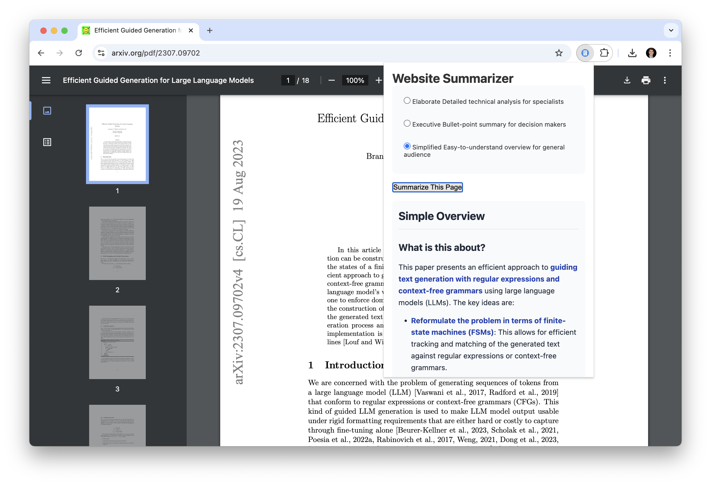

# Website Summarizer Chrome Extension

A Chrome extension that summarizes web pages using AI. The extension converts webpage content to markdown and then uses Claude (Anthropic's AI) to generate concise summaries with three different styles for different audiences.



## Features

- Convert webpages to markdown using r.jina.ai
- Generate summaries using Claude AI
- Three summarization styles:
  - **Elaborate**: Detailed technical analysis for specialists and domain experts
  - **Executive**: Bullet-point summaries for decision-makers
  - **Simplified**: Easy-to-understand overviews for general audiences
- Markdown rendering for formatted output
- Simple, user-friendly interface
- Secure API key management
- Options page for configuration

## Prerequisites

- Node.js and npm installed
- Chrome browser
- Anthropic API key

## Installation

1. Clone this repository:
```bash
git clone https://github.com/wesslen/chrome-extension-summarizer.git
cd website-summarizer
```

2. Install dependencies:
```bash
# Install main dependencies
npm install

# Install development dependencies for markdown and build process
npm install --save-dev @babel/core @babel/preset-env babel-loader marked
```

3. Build the extension:
```bash
npm run build
```

4. Load the extension in Chrome:
   - Open Chrome and navigate to `chrome://extensions/`
   - Enable "Developer mode" in the top right
   - Click "Load unpacked"
   - Select the `dist` directory from your project folder

## Configuration

1. Click the extension icon in Chrome
2. Click "Configure API Key" or right-click the extension icon and select "Options"
3. Enter your Anthropic API key
4. Click "Save"

## Usage

1. Navigate to any webpage you want to summarize
2. Click the extension icon in your Chrome toolbar
3. Select your preferred summary style:
   - Elaborate: For technical and detailed analysis
   - Executive: For bullet-point summaries
   - Simplified: For easy-to-understand overviews
4. Click "Summarize This Page"
5. View the formatted markdown summary

## Development

### File Structure
```
website-summarizer/
├── src/
│   ├── popup/
│   │   ├── popup.html
│   │   ├── popup.js     # Includes markdown rendering
│   │   └── popup.css    # Includes markdown styles
│   ├── background/
│   │   └── background.js # Includes style-specific prompts
│   └── options/
│       ├── options.html
│       └── options.js
├── assets/
│   ├── icon48.png
│   └── icon128.png
├── dist/          # Generated after building
├── manifest.json
├── package.json
├── webpack.config.js
├── .env           # Environmental variables (don't commit!)
└── .gitignore
```

### Local Development

1. Make changes to files in the `src` directory
2. Run `npm run build` to build the extension
3. Refresh the extension in Chrome to see your changes

### Building

```bash
npm run build
```

The built extension will be in the `dist` directory.

### Content Security Policy (CSP)

The extension follows secure CSP practices:
- Uses webpack to bundle all dependencies
- Avoids external script loading
- Maintains 'self' script-src directive
- Properly bundles markdown parser (marked.js)

## Security Notes

- Never commit your API keys
- The extension uses Chrome's storage API to securely store your API key
- API calls are made directly to Anthropic's API with appropriate headers
- All scripts are bundled and comply with CSP
- Markdown rendering is configured with secure options

## Permissions

The extension requires the following permissions:
- `activeTab`: To access the current webpage
- `scripting`: To interact with webpage content
- `storage`: To store API keys and user preferences
- Host permissions for api.anthropic.com and r.jina.ai

## Features in Detail

### Summarization Styles

1. **Elaborate Style**
   - Detailed technical analysis
   - Comprehensive markdown formatting
   - Section headers and subsections
   - Key concepts in bold
   - Suitable for technical audiences

2. **Executive Style**
   - Bullet-point summaries
   - Key metrics and findings in bold
   - Clear section organization
   - Focused on decision-relevant information
   - Suitable for business stakeholders

3. **Simplified Style**
   - Easy-to-read format
   - Clear explanations
   - Basic markdown structure
   - Avoids technical jargon
   - Suitable for general readers

### Markdown Features

- Headers for section organization
- Bold text for key concepts
- Bullet points for lists
- Blockquotes for important quotes
- Proper spacing and formatting
- Styled output in extension popup

## Acknowledgments

- Uses r.jina.ai for markdown conversion
- Uses Anthropic's Claude for AI summarization
- Uses marked.js for markdown parsing
- Uses webpack for secure bundling
